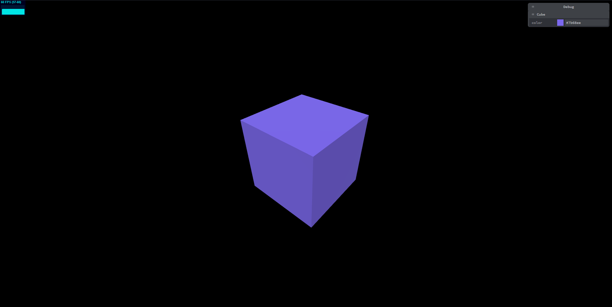

# Next.js + Three.js Project Starter Kit

A quick and minimal project starter kit for Three.js projects built with Next.js.

## Preview

[https://next-three-starter.vercel.app](https://next-three-starter.vercel.app)

## Features

- Standard Scene, Camera, Lighting
- Animation (via THREE.Clock)
- Orbit Controls
- Responsiveness
- Debug GUI (via Tweakpane)
- FPS monitor (via stats.js)

## Setup

- Git clone this repository
- cd into the repository directory
- Run `npm install` or `yarn` to install the project dependencies
- Run `npm run dev` or `yarn dev` to start the project dev server
- Visit `localhost:3000` in your web browser
- You should see a cube rotating, an fps-counter on the top-left & a debug panel on the top-right

## Links

- Next.js ([Docs](https://nextjs.org/docs/getting-started) / [Github](https://github.com/vercel/next.js))
- Three.js ([Docs](https://threejs.org/docs/index.html#manual/en/introduction/Creating-a-scene) / [Github](https://github.com/mrdoob/three.js/))
- Tweakpane ([Github](https://github.com/cocopon/tweakpane) / [Website](https://cocopon.github.io/tweakpane/))
- stats.js ([Github](https://github.com/mrdoob/stats.js/))
